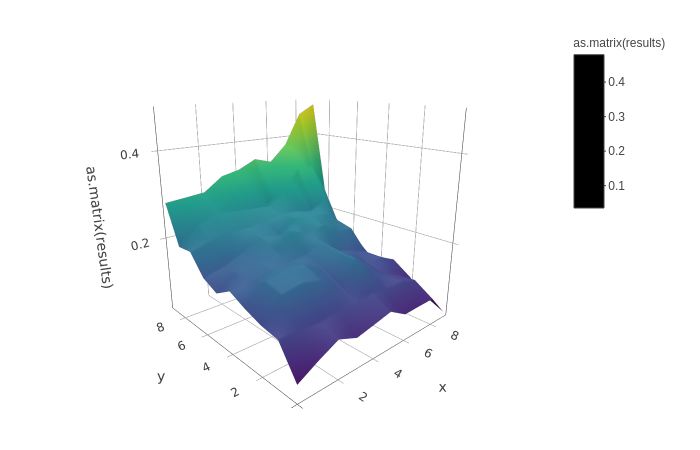

| [Linux][lin-link] |  [Codecov][cov-link]   |
| :---------------: |  :-------------------: |
| ![lin-badge]      |  ![cov-badge]          |

[lin-badge]: https://travis-ci.com/phillyfan1138/ModelMonitor.svg?branch=master "Travis build status"
[lin-link]:  https://travis-ci.com/phillyfan1138/ModelMonitor "Travis build status"
[cov-badge]: https://codecov.io/gh/phillyfan1138/ModelMonitor/branch/master/graph/badge.svg
[cov-link]:  https://codecov.io/gh/phillyfan1138/ModelMonitor

# Scala code for Model Monitoring in spark

This library contains two monitoring capabilities: Concept Drift monitoring, and State Space Exploration.  Concept drift monitors how the distribution of inputs changes over time.  State Space Exploration simulates from the possible inputs and performs PCA to help plot predictions in three dimensions.  

## Install

Clone this repository, and use `sbt test` to run the tests.  To publish locally, run `sbt publishLocal`.  To add to a pyspark session, run `pyspark --packages ml.dhs:modelmonitor_2.11:0.0.1`

## Concept Drift monitoring

```scala
import modelmonitor.{ConceptDrift, ColumnType, ColumnDescription}
val columnNameAnyTypeArray=Array(
    ColumnDescription("columnName1", ColumnType.Categorical.toString),
    ColumnDescription("columnName2", ColumnType.Categorical.toString),
    ColumnDescription("columnName3", ColumnType.Numeric.toString)
)
// trainDataset is a spark dataframe containing the inputs to the model
val distribution=ConceptDrift.getDistributionss(
    trainDataset, columnNameAnyTypeArray
)
//saved for later monitoring
val isSaved=ConceptDrift.saveDistribution(distribution, "test.json")
//load the saved distribution
val resultSaved=ConceptDrift.loadDistribution("test.json")
//compare the new distribution to the old distribution
val result=ConceptDrift.getNewDistributionsAndCompare(testDataset, resultSaved)
```

An example of the saved distribution is in [the test.json](./docs/test.json) file.

## State Space Exploration

```scala
import modelmonitor.{StateSpaceXploration, ColumnType, ColumnSummary}
val columns=Array(
    ColumnSummary("v1", ColumnType.Categorical.toString, Right(Array(
        "a", "b", "c"
    ))),
    ColumnSummary("v2", ColumnType.Numeric.toString, Left(Array(-5.0, 5.0))),
    ColumnSummary("v3", ColumnType.Numeric.toString, Left(Array(-5.0, 5.0))),
    ColumnSummary("v4", ColumnType.Numeric.toString, Left(Array(-5.0, 5.0))),
    ColumnSummary("v5", ColumnType.Categorical.toString, Right(Array(
        "f", "g", "h", "i"
    )))
)
//give it a seed
val ssx=new StateSpaceXploration(42)
//simulate 100000 inputs
val simulatedDataSet=ssx.generateDataSet(sc, sqlCtx, 100000, columns)

val result=ssx.getPredictions(
    simulatedDataSet,
    p //Fitted pipeline: type PipelineModel
).collect() //guaranteed to be 100 or less since we have 10 quantiles in two dimensions
```

Results from simulated data:

